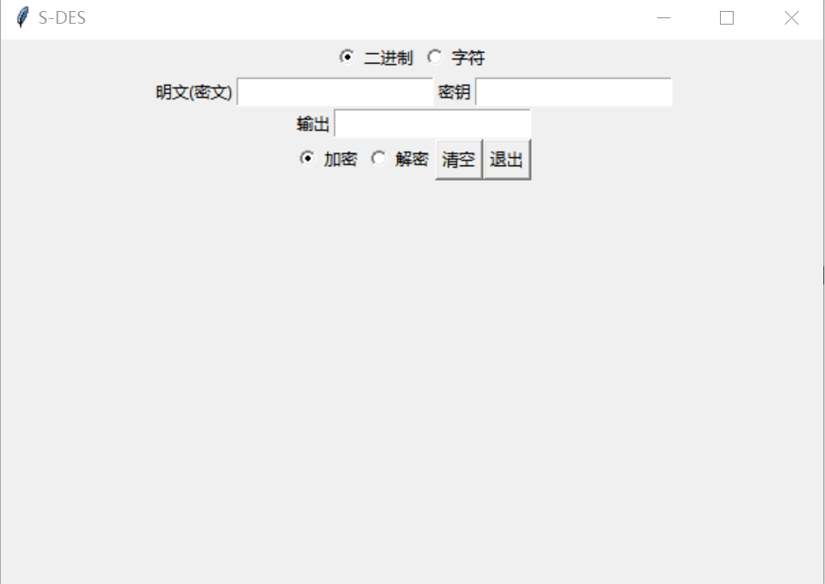
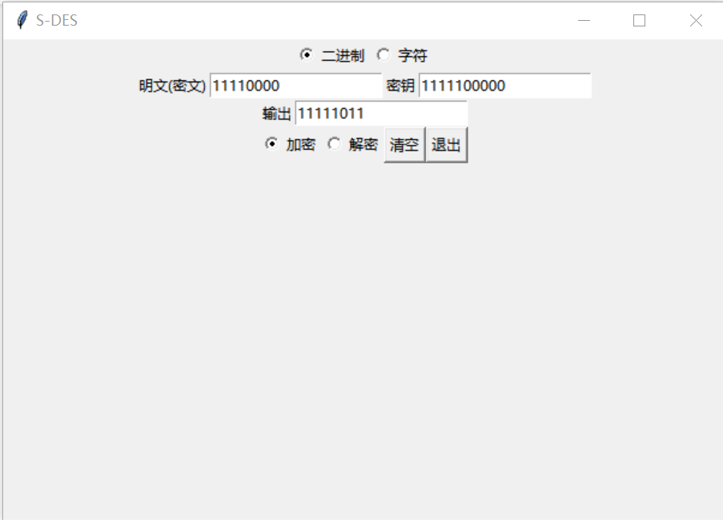
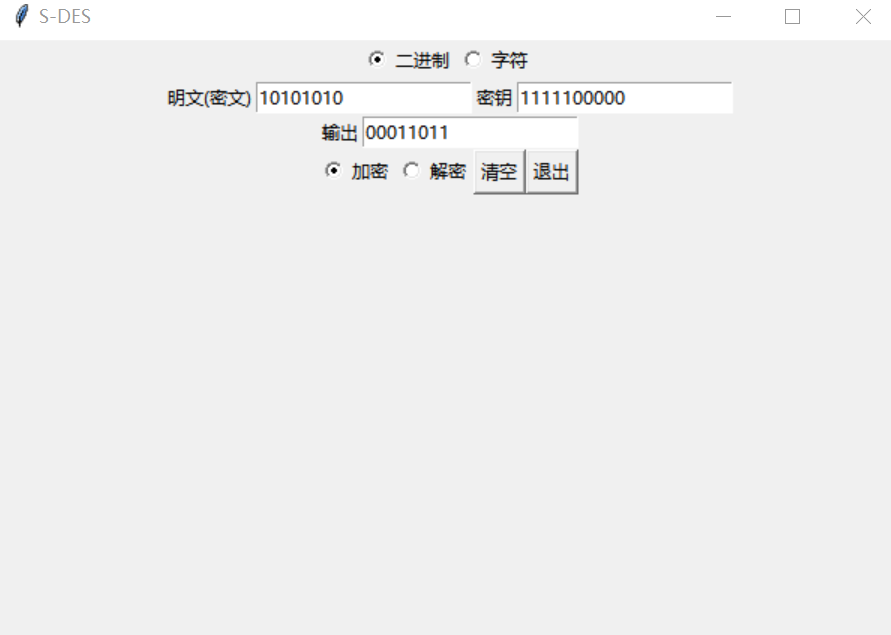
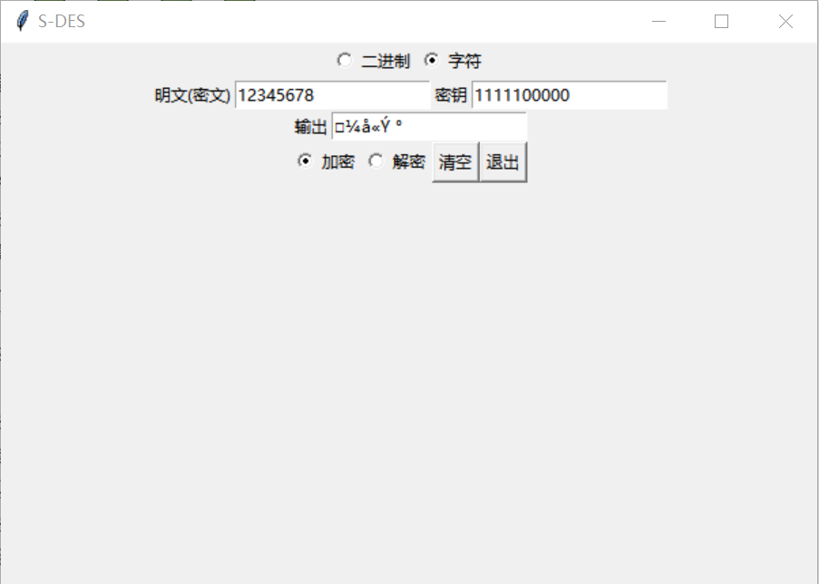

# HW1：S-DES算法的实现

## 作业介绍：

根据讲述的S-DES算法，使用你们自己最擅长的程序语言(C++/QT或Java+Swing、Python+QT等)来编程实现加、解密程序。

## 作业测试结果：

### 第一关：基本测试

#### 算法编写

根据课程所讲原理，我们使用python语言实现了**S-DES**算法，加解密主要框架如下（具体实现见main_function.py）

```python
# 加密
def encrypt(plain_text,key):
    bits = permutate(plain_text, FIXED_IP)
    temp = f_k(bits, key1(key))
    bits = right_half(bits) + temp
    bits = f_k(bits, key2(key))
    return permutate(bits + temp, FIXED_IP_INVERSE)

# 解密
def decrypt(cipher_text,key):
    bits = permutate(cipher_text, FIXED_IP)
    temp = f_k(bits, key2(key))
    bits = right_half(bits) + temp
    bits = f_k(bits, key1(key))
    return permutate(bits + temp, FIXED_IP_INVERSE)
```

#### UI实现

通过筛选，我们选择使用简单轻便的tkinter作为UI显示交互的框架。具体交互界面如下图所示



以明文为：11110000，密钥为：1111100000进行加密，得到的密文如下图所示



### 第二关：交叉测试

我们通过参考 `HelloWorld`小组的程序（基于java）来进行交叉测试，他们的密钥和明文加密结果如下图：


而我们明密文加密如下图



### 第三关：扩展功能

在交互界面中，选择字符选项，则可输入ASCII编码字符串，具体显示与第一关相似。

如以明文为：12345678，密钥为：1111100000，得到密文如下图




### 第四关：暴力破解

这里我们以 **明文为：00000011,00001010,00001111；密文为：11001110,00010101,10000101**为明密文对进行暴力破解，并在破解过程中利用cv2库添加视频帧，生成视频`crack_video_4.avi`，可点击该视频查看破解过程。

```tex
找到的所有密钥为:
1011100000
1111100000
破解时间: 3.97475004196167 秒
```


### 第五关：封闭测试

这里我们以第四关的第一个明密文对即 **明文为：11101010；密文为：10000010**为例子对进行暴力破解，并在破解过程中利用cv2库添加视频帧，生成视频`crack_video_5.avi`，可点击该视频查看破解过程。

该明密文对暴力破解结果如下

```tex
找到的所有密钥为:
1000001001
1011010001
1100001001
1111010001
破解时间: 4.942691087722778 秒
```

对于随机选择的明密文确实可能不止1个密钥key